# Hệ thống luyện thi trực tuyến – Trường THPT Vĩnh Thạnh (Gia Lai)

Trang web: <https://trangtu66.github.io/Taode_thi_online/> · Cổng toàn trường: <https://trangtu66.github.io/Taode_thi_online/luyen_thi.html>

Kho gồm hai phần: **trang web** (thư mục gốc) và **kho học liệu theo môn** (`mon/`).

## 1. Kho học liệu theo môn – `mon/<môn>/`

Môn nào cũng có đúng các ngăn như môn Toán:

```
mon/
├── toan/                 Môn Toán (Tổ Toán)
│   ├── khbd/             Kế hoạch bài dạy (Word)      lop10/ lop11/ lop12/
│   ├── slide/            Bài giảng PowerPoint           lop10/ lop11/ lop12/
│   ├── trac_nghiem/      Đề trực tuyến: nguồn JSON + đề Word có đáp án, lời giải   lop10/ lop11/ lop12/
│   └── ma_tran/          Ma trận, bản đặc tả đề luyện tập / kiểm tra
├── ngu_van/              Môn Ngữ văn (bản demo)
├── hoa_hoc/  sinh_hoc/  lich_su/  dia_li/  gdkt_pl/  tieng_anh/   (bản demo: bài củng cố lớp 10)
│   └── mỗi môn: khbd/  slide/  trac_nghiem/  ma_tran/
└── vat_li/               Môn Vật lí (đang xây dựng)
```

Mã môn dùng trong tên thư mục: `toan`, `ngu_van`, `vat_li`, `hoa_hoc`, `sinh_hoc`, `lich_su`, `dia_li`, `gdkt_pl`, `tin_hoc`, `cong_nghe`, `tieng_anh`.

Quy ước tên file: `KHBD_<MÔN><Khối>_<TênBài>_T<Tiết>.docx`, `Slide_<MÔN><Khối>_<TênBài>_T<Tiết>.pptx`
(ví dụ `KHBD_TOAN11_Bai7_T15-16.docx`, `Slide_TOAN11_Bai7_T15-16.pptx`).

## 2. Trang web – thư mục gốc (KHÔNG di chuyển)

Mã QR in trên slide, KHBD và các link đã gửi học sinh trỏ thẳng vào những file này, nên chúng phải nằm yên ở gốc:

| File | Vai trò |
|---|---|
| `index.html` | Trang chủ môn Toán (chuyển link `#e=` sang `lam_bai.html` – giữ nguyên đoạn này) |
| `luyen_thi.html` | Cổng luyện thi toàn trường: chọn môn |
| `luyen_tap.html` | Luyện tập Toán theo bài, chương, định kỳ, tốt nghiệp |
| `lam_bai.html` | Trang làm bài và chấm điểm (dùng chung mọi môn) |
| `quan_ly.html`, `ket_qua.html`, `xep_hang.html` | Quản lí bài, kết quả, xếp hạng |
| `cau_hinh.js` | Danh sách bài + địa chỉ nhận kết quả |
| `de_luyen_tap.js`, `van_demo.js`, `mon_demo.js` | Danh mục đề hiển thị trên cổng |
| `cc_*.html` | Bài củng cố cuối tiết (Toán) – đích của mã QR |
| `lt_*`, `oc_*`, `dk_*`, `tn_*.html` | Đề luyện tập 3 dạng, ôn chương, định kỳ, tốt nghiệp (Toán) |
| `van_*.html` | Bài trực tuyến môn Ngữ văn |
| `hoa_*`, `sinh_*`, `su_*`, `dia_*`, `gdkt_*`, `anh_*.html` | Bài trực tuyến Hóa, Sinh, Sử, Địa, GDKT&PL, Tiếng Anh |
| `*.png`, `hinh_de/` | Ảnh minh hoạ trong đề (các trang làm bài đang dùng) |

Trang làm bài của môn mới đặt tên theo mẫu `<mã môn>_<loại>_<bài>_k<khối>.html`, ví dụ `ly_cc_bai1_k10.html`.

## 3. Không đưa lên kho

`NHAN_KET_QUA/` (mã giáo viên, mã Apps Script) và đề kiểm tra chính thức trước giờ thi.

---

## 4. Sơ đồ tư duy bài học

> Chuẩn màu: 🔵 tiêu đề gốc `#1E40AF` · nhánh tím `#7C3AED` · xanh lá `#065F46` · đỏ `#B91C1C` · cam `#B45309` · lá sáng `#EDE9FE / #D1FAE5 / #FEE2E2 / #FEF3C7`

---

## 🗺️ Sơ đồ tư duy tổng quan – Toán 10 Học kì I

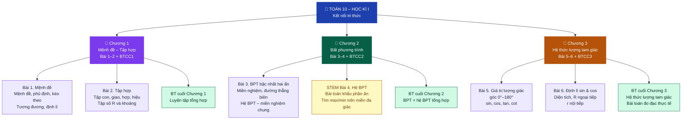

---

## 🗺️ Sơ đồ tư duy tổng quan – Toán 11 Học kì I

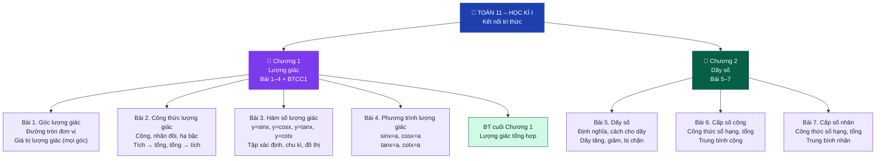

---

## 🗺️ Sơ đồ tư duy tổng quan – Toán 12 Học kì I

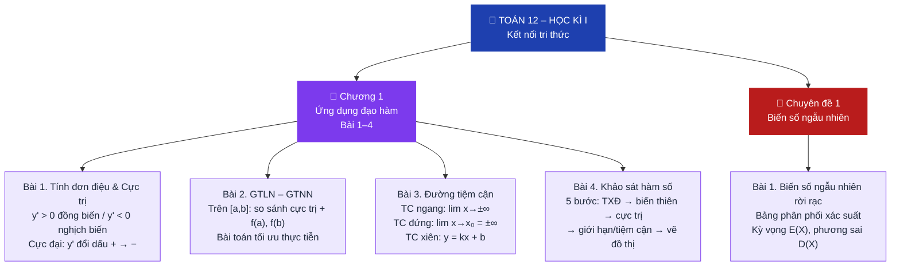

---

## 🗺️ Sơ đồ tư duy tổng quan – Vật lí 12 Học kì I

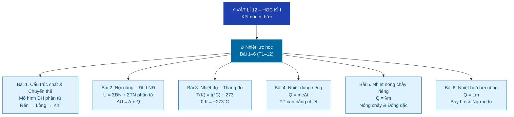

---

## 📌 Sơ đồ tư duy từng bài – Toán 10

### Toán 10 – Bài 1. Mệnh đề *(Tiết 1–4)*

```mermaid
graph TD
    G["🎯 BÀI 1 · TOÁN 10<br/>Mệnh đề"]:::root
    G --> A["① Mệnh đề<br/>và phủ định"]:::n1
    G --> B["② Kéo theo<br/>và tương đương"]:::n2
    G --> C["③ Mệnh đề<br/>có chứa biến"]:::n3
    G --> D["④ Ứng dụng<br/>trong toán học"]:::n4

    A --> A1["Mệnh đề: câu có T/S xác định"]:::l1
    A --> A2["Phủ định ¬P"]:::l1
    A --> A3["Mệnh đề chứa biến P(x)"]:::l1

    B --> B1["P ⇒ Q: P đúng thì Q đúng"]:::l2
    B --> B2["P ⇔ Q: cùng đúng hoặc cùng sai"]:::l2
    B --> B3["Đảo, phản đảo, đảo phủ"]:::l2

    C --> C1["∀x: mọi x thỏa mãn"]:::l3
    C --> C2["∃x: tồn tại x thỏa mãn"]:::l3
    C --> C3["Phủ định ∀ ↔ ∃ và ngược lại"]:::l3

    D --> D1["Điều kiện cần (⇒)"]:::l4
    D --> D2["Điều kiện đủ (⇐)"]:::l4
    D --> D3["ĐK cần và đủ (⇔)"]:::l4

    classDef root fill:#1E40AF,color:#fff,stroke:#1E40AF
    classDef n1 fill:#7C3AED,color:#fff,stroke:#7C3AED
    classDef n2 fill:#065F46,color:#fff,stroke:#065F46
    classDef n3 fill:#B91C1C,color:#fff,stroke:#B91C1C
    classDef n4 fill:#B45309,color:#fff,stroke:#B45309
    classDef l1 fill:#EDE9FE,color:#1E293B,stroke:#7C3AED
    classDef l2 fill:#D1FAE5,color:#022c22,stroke:#065F46
    classDef l3 fill:#FEE2E2,color:#450a0a,stroke:#B91C1C
    classDef l4 fill:#FEF3C7,color:#451a03,stroke:#B45309
```

> **Bài củng cố:** <https://trangtu66.github.io/Taode_thi_online/cc_bai1_t10.html>

---

### Toán 10 – Bài 2. Tập hợp *(Tiết 5–9)*

```mermaid
graph TD
    G["🎯 BÀI 2 · TOÁN 10<br/>Tập hợp"]:::root
    G --> A["① Khái niệm<br/>tập hợp"]:::n1
    G --> B["② Tập con &<br/>tập hợp bằng nhau"]:::n2
    G --> C["③ Phép toán<br/>tập hợp"]:::n3
    G --> D["④ Tập số R<br/>và khoảng"]:::n4

    A --> A1["Phần tử thuộc ∈ / không thuộc ∉"]:::l1
    A --> A2["Tập rỗng ∅"]:::l1
    A --> A3["Biểu đồ Venn"]:::l1

    B --> B1["A ⊂ B: mọi x∈A thì x∈B"]:::l2
    B --> B2["A = B ⟺ A⊂B và B⊂A"]:::l2
    B --> B3["Số tập con của A: 2ⁿ (|A|=n)"]:::l2

    C --> C1["A ∩ B: phần tử thuộc cả hai"]:::l3
    C --> C2["A ∪ B: thuộc ít nhất một"]:::l3
    C --> C3["A \ B: thuộc A không thuộc B"]:::l3
    C --> C4["Cᵤ(A): bù của A trong U"]:::l3

    D --> D1["(a;b), [a;b], (a;b], [a;b)"]:::l4
    D --> D2["(a;+∞), (−∞;b)"]:::l4
    D --> D3["Giao, hợp khoảng"]:::l4

    classDef root fill:#1E40AF,color:#fff,stroke:#1E40AF
    classDef n1 fill:#7C3AED,color:#fff,stroke:#7C3AED
    classDef n2 fill:#065F46,color:#fff,stroke:#065F46
    classDef n3 fill:#B91C1C,color:#fff,stroke:#B91C1C
    classDef n4 fill:#B45309,color:#fff,stroke:#B45309
    classDef l1 fill:#EDE9FE,color:#1E293B,stroke:#7C3AED
    classDef l2 fill:#D1FAE5,color:#022c22,stroke:#065F46
    classDef l3 fill:#FEE2E2,color:#450a0a,stroke:#B91C1C
    classDef l4 fill:#FEF3C7,color:#451a03,stroke:#B45309
```

> **Bài củng cố:** <https://trangtu66.github.io/Taode_thi_online/cc_bai2_t10.html>

---

### Toán 10 – Bài 3. BPT bậc nhất hai ẩn *(Tiết 10–13)*

```mermaid
graph TD
    G["🎯 BÀI 3 · TOÁN 10<br/>BPT bậc nhất hai ẩn"]:::root
    G --> A["① BPT bậc nhất<br/>hai ẩn"]:::n1
    G --> B["② Miền nghiệm<br/>của BPT"]:::n2
    G --> C["③ Hệ BPT<br/>bậc nhất hai ẩn"]:::n3
    G --> D["④ Ứng dụng<br/>thực tiễn"]:::n4

    A --> A1["ax + by ≤ c (a,b không đồng thời =0)"]:::l1
    A --> A2["Nghiệm (x₀;y₀): thay thỏa mãn"]:::l1

    B --> B1["Đường thẳng d: ax+by = c"]:::l2
    B --> B2["Chọn điểm thử (thường O)"]:::l2
    B --> B3["Miền nghiệm: nửa mặt phẳng<br/>bờ là đường thẳng d"]:::l2

    C --> C1["Miền nghiệm chung = giao các miền"]:::l3
    C --> C2["Miền đa giác (có thể vô hạn)"]:::l3
    C --> C3["Đỉnh = giao các đường biên"]:::l3

    D --> D1["Bài toán lập kế hoạch SX"]:::l4
    D --> D2["Tìm max/min tuyến tính<br/>tại đỉnh của miền đa giác"]:::l4

    classDef root fill:#1E40AF,color:#fff,stroke:#1E40AF
    classDef n1 fill:#7C3AED,color:#fff,stroke:#7C3AED
    classDef n2 fill:#065F46,color:#fff,stroke:#065F46
    classDef n3 fill:#B91C1C,color:#fff,stroke:#B91C1C
    classDef n4 fill:#B45309,color:#fff,stroke:#B45309
    classDef l1 fill:#EDE9FE,color:#1E293B,stroke:#7C3AED
    classDef l2 fill:#D1FAE5,color:#022c22,stroke:#065F46
    classDef l3 fill:#FEE2E2,color:#450a0a,stroke:#B91C1C
    classDef l4 fill:#FEF3C7,color:#451a03,stroke:#B45309
```

> **Bài củng cố:** <https://trangtu66.github.io/Taode_thi_online/cc_bai3_t10.html>

---

### Toán 10 – STEM Bài 4. Hệ BPT & Khẩu phần ăn *(Tiết 14)*

```mermaid
graph TD
    G["🎯 STEM BÀI 4 · TOÁN 10<br/>Hệ BPT – Khẩu phần ăn"]:::root
    G --> A["① Mô hình hóa<br/>bài toán thực tế"]:::n1
    G --> B["② Lập hệ BPT<br/>từ ràng buộc"]:::n2
    G --> C["③ Vẽ miền nghiệm<br/>& tìm tối ưu"]:::n3
    G --> D["④ Đánh giá<br/>& mở rộng"]:::n4

    A --> A1["Thực phẩm: protein, lipid, glucid"]:::l1
    A --> A2["Biến: x (loại 1), y (loại 2)"]:::l1

    B --> B1["BPT dinh dưỡng: ax+by ≥ nhu cầu"]:::l2
    B --> B2["BPT ngân sách: p₁x+p₂y ≤ budget"]:::l2
    B --> B3["BPT không âm: x≥0, y≥0"]:::l2

    C --> C1["Vẽ miền nghiệm chung"]:::l3
    C --> C2["Tìm đỉnh đa giác"]:::l3
    C --> C3["Hàm mục tiêu f(x,y)=ax+by → min/max"]:::l3

    D --> D1["Kiểm tra điều kiện thực tế"]:::l4
    D --> D2["Báo cáo STEM: nhóm 4–6 HS"]:::l4

    classDef root fill:#B45309,color:#fff,stroke:#B45309
    classDef n1 fill:#7C3AED,color:#fff,stroke:#7C3AED
    classDef n2 fill:#065F46,color:#fff,stroke:#065F46
    classDef n3 fill:#B91C1C,color:#fff,stroke:#B91C1C
    classDef n4 fill:#B45309,color:#fff,stroke:#B45309
    classDef l1 fill:#EDE9FE,color:#1E293B,stroke:#7C3AED
    classDef l2 fill:#D1FAE5,color:#022c22,stroke:#065F46
    classDef l3 fill:#FEE2E2,color:#450a0a,stroke:#B91C1C
    classDef l4 fill:#FEF3C7,color:#451a03,stroke:#B45309
```

---

### Toán 10 – Bài 5. Giá trị lượng giác của góc từ 0° đến 180° *(Tiết 16–17)*

```mermaid
graph TD
    G["🎯 BÀI 5 · TOÁN 10<br/>Giá trị lượng giác góc 0°–180°"]:::root
    G --> A["① Định nghĩa<br/>qua đường tròn ĐV"]:::n1
    G --> B["② Bảng giá trị<br/>đặc biệt"]:::n2
    G --> C["③ Tính chất<br/>& hệ thức"]:::n3
    G --> D["④ Ứng dụng<br/>trong tam giác"]:::n4

    A --> A1["sin α = tung độ M trên đtròn ĐV"]:::l1
    A --> A2["cos α = hoành độ M"]:::l1
    A --> A3["tan α = sin/cos (cos≠0)"]:::l1
    A --> A4["cot α = cos/sin (sin≠0)"]:::l1

    B --> B1["30°: sin=½, cos=√3/2"]:::l2
    B --> B2["45°: sin=cos=√2/2"]:::l2
    B --> B3["60°: sin=√3/2, cos=½"]:::l2
    B --> B4["120°, 135°, 150°: bù góc nhọn"]:::l2

    C --> C1["sin²α + cos²α = 1"]:::l3
    C --> C2["sin(180°−α) = sinα"]:::l3
    C --> C3["cos(180°−α) = −cosα"]:::l3

    D --> D1["Quy tắc sin trong tam giác"]:::l4
    D --> D2["Góc A tù ⟺ cosA < 0"]:::l4

    classDef root fill:#1E40AF,color:#fff,stroke:#1E40AF
    classDef n1 fill:#7C3AED,color:#fff,stroke:#7C3AED
    classDef n2 fill:#065F46,color:#fff,stroke:#065F46
    classDef n3 fill:#B91C1C,color:#fff,stroke:#B91C1C
    classDef n4 fill:#B45309,color:#fff,stroke:#B45309
    classDef l1 fill:#EDE9FE,color:#1E293B,stroke:#7C3AED
    classDef l2 fill:#D1FAE5,color:#022c22,stroke:#065F46
    classDef l3 fill:#FEE2E2,color:#450a0a,stroke:#B91C1C
    classDef l4 fill:#FEF3C7,color:#451a03,stroke:#B45309
```

> **Bài củng cố:** <https://trangtu66.github.io/Taode_thi_online/cc_bai5_t10.html>

---

### Toán 10 – Bài 6. Định lí sin, cos & Diện tích tam giác *(Tiết 18–21)*

```mermaid
graph TD
    G["🎯 BÀI 6 · TOÁN 10<br/>Định lí sin, cosin & Diện tích"]:::root
    G --> A["① Định lí sin"]:::n1
    G --> B["② Định lí cosin"]:::n2
    G --> C["③ Diện tích<br/>R ngoại & r nội tiếp"]:::n3
    G --> D["④ Bài toán<br/>đo đạc thực tiễn"]:::n4

    A --> A1["a/sinA = b/sinB = c/sinC = 2R"]:::l1
    A --> A2["Tìm cạnh khi biết 2 góc + 1 cạnh"]:::l1
    A --> A3["Tìm góc khi biết 3 cạnh"]:::l1

    B --> B1["a² = b²+c²−2bc·cosA"]:::l2
    B --> B2["cosA = (b²+c²−a²)/(2bc)"]:::l2
    B --> B3["Tìm cạnh khi biết 2 cạnh + góc xen"]:::l2

    C --> C1["S = ½bc·sinA = ½ac·sinB = ½ab·sinC"]:::l3
    C --> C2["R = a/(2sinA) – bán kính ngoại tiếp"]:::l3
    C --> C3["r = S/p; p=(a+b+c)/2 – bán kính nội tiếp"]:::l3

    D --> D1["Đo khoảng cách không trực tiếp"]:::l4
    D --> D2["Xác định chiều cao, khoảng cách đảo"]:::l4

    classDef root fill:#1E40AF,color:#fff,stroke:#1E40AF
    classDef n1 fill:#7C3AED,color:#fff,stroke:#7C3AED
    classDef n2 fill:#065F46,color:#fff,stroke:#065F46
    classDef n3 fill:#B91C1C,color:#fff,stroke:#B91C1C
    classDef n4 fill:#B45309,color:#fff,stroke:#B45309
    classDef l1 fill:#EDE9FE,color:#1E293B,stroke:#7C3AED
    classDef l2 fill:#D1FAE5,color:#022c22,stroke:#065F46
    classDef l3 fill:#FEE2E2,color:#450a0a,stroke:#B91C1C
    classDef l4 fill:#FEF3C7,color:#451a03,stroke:#B45309
```

> **Bài củng cố:** <https://trangtu66.github.io/Taode_thi_online/cc_bai6_t10.html>

---

### Toán 10 – Bài tập cuối Chương III. Hệ thức lượng trong tam giác *(Tiết 22)*

```mermaid
graph TD
    G["🎯 CHƯƠNG III · TOÁN 10<br/>Hệ thức lượng trong tam giác"]:::root
    G --> A["① Góc từ 0° đến 180°<br/>Giá trị LG đặc biệt"]:::n1
    G --> B["② Định lí Sin & Cosin"]:::n2
    G --> C["③ Diện tích & R, r"]:::n3
    G --> D["④ Bài tập ứng dụng<br/>thực tiễn"]:::n4

    A --> A1["sin²α + cos²α = 1"]:::l1
    A --> A2["sin(180°–α) = sinα"]:::l1
    A --> A3["cos(180°–α) = –cosα"]:::l1
    A --> A4["Bảng 30°, 45°, 60°, 120°, 135°, 150°"]:::l1

    B --> B1["a/sinA = b/sinB = c/sinC = 2R"]:::l2
    B --> B2["a² = b²+c²–2bc·cosA"]:::l2
    B --> B3["cosA = (b²+c²–a²)/(2bc)"]:::l2

    C --> C1["S = ½bc·sinA"]:::l3
    C --> C2["R = a/(2sinA) – ngoại tiếp"]:::l3
    C --> C3["r = S/p; p = (a+b+c)/2 – nội tiếp"]:::l3

    D --> D1["Tính S, R, r khi biết 2 cạnh, 1 góc"]:::l4
    D --> D2["Đo đạc thực tế (Bài 3.18, 3.19 SGK)"]:::l4

    classDef root fill:#1E40AF,color:#fff,stroke:#1E40AF
    classDef n1 fill:#7C3AED,color:#fff,stroke:#7C3AED
    classDef n2 fill:#065F46,color:#fff,stroke:#065F46
    classDef n3 fill:#B91C1C,color:#fff,stroke:#B91C1C
    classDef n4 fill:#B45309,color:#fff,stroke:#B45309
    classDef l1 fill:#EDE9FE,color:#1E293B,stroke:#7C3AED
    classDef l2 fill:#D1FAE5,color:#022c22,stroke:#065F46
    classDef l3 fill:#FEE2E2,color:#450a0a,stroke:#B91C1C
    classDef l4 fill:#FEF3C7,color:#451a03,stroke:#B45309
```

> **Bài củng cố:** <https://trangtu66.github.io/Taode_thi_online/cc_chuong3_t10.html>

---

## 📌 Sơ đồ tư duy từng bài – Toán 11

### Toán 11 – Bài 1. Góc lượng giác – Giá trị lượng giác *(Tiết 1–4)*

```mermaid
graph TD
    G["🎯 BÀI 1 · TOÁN 11<br/>Góc lượng giác & Giá trị LG"]:::root
    G --> A["① Góc lượng giác<br/>& đường tròn ĐV"]:::n1
    G --> B["② Giá trị lượng giác<br/>của góc α bất kỳ"]:::n2
    G --> C["③ Hệ thức cơ bản"]:::n3
    G --> D["④ Giá trị LG<br/>của các góc đặc biệt"]:::n4

    A --> A1["Chiều dương: ngược chiều kim đồng hồ"]:::l1
    A --> A2["Góc LG: α + k·360°, k ∈ ℤ"]:::l1
    A --> A3["Đường tròn đơn vị bán kính 1"]:::l1

    B --> B1["sinα = tung độ M(cosα; sinα)"]:::l2
    B --> B2["cosα = hoành độ M"]:::l2
    B --> B3["tanα = sinα/cosα (cosα ≠ 0)"]:::l2
    B --> B4["Dấu theo góc phần tư"]:::l2

    C --> C1["sin²α + cos²α = 1"]:::l3
    C --> C2["1 + tan²α = 1/cos²α"]:::l3
    C --> C3["1 + cot²α = 1/sin²α"]:::l3

    D --> D1["0°, 30°, 45°, 60°, 90°, 180°, 270°, 360°"]:::l4
    D --> D2["Góc bù, phụ, đối, hơn 90°"]:::l4

    classDef root fill:#1E40AF,color:#fff,stroke:#1E40AF
    classDef n1 fill:#7C3AED,color:#fff,stroke:#7C3AED
    classDef n2 fill:#065F46,color:#fff,stroke:#065F46
    classDef n3 fill:#B91C1C,color:#fff,stroke:#B91C1C
    classDef n4 fill:#B45309,color:#fff,stroke:#B45309
    classDef l1 fill:#EDE9FE,color:#1E293B,stroke:#7C3AED
    classDef l2 fill:#D1FAE5,color:#022c22,stroke:#065F46
    classDef l3 fill:#FEE2E2,color:#450a0a,stroke:#B91C1C
    classDef l4 fill:#FEF3C7,color:#451a03,stroke:#B45309
```

> **Bài củng cố:** <https://trangtu66.github.io/Taode_thi_online/cc_bai1_t11.html>

---

### Toán 11 – Bài 2. Công thức lượng giác *(Tiết 5–7)*

```mermaid
graph TD
    G["🎯 BÀI 2 · TOÁN 11<br/>Công thức lượng giác"]:::root
    G --> A["① Công thức<br/>cộng"]:::n1
    G --> B["② Công thức<br/>nhân đôi"]:::n2
    G --> C["③ Công thức<br/>hạ bậc"]:::n3
    G --> D["④ Tích → Tổng<br/>Tổng → Tích"]:::n4

    A --> A1["sin(a±b) = sinacosb ± cosasinb"]:::l1
    A --> A2["cos(a±b) = cosacosb ∓ sinasinb"]:::l1
    A --> A3["tan(a±b) = (tana±tanb)/(1∓tanatanb)"]:::l1

    B --> B1["sin2a = 2sinacosa"]:::l2
    B --> B2["cos2a = cos²a−sin²a = 2cos²a−1 = 1−2sin²a"]:::l2
    B --> B3["tan2a = 2tana/(1−tan²a)"]:::l2

    C --> C1["cos²a = (1+cos2a)/2"]:::l3
    C --> C2["sin²a = (1−cos2a)/2"]:::l3

    D --> D1["2sinacosb = sin(a+b)+sin(a−b)"]:::l4
    D --> D2["sina+sinb = 2sin((a+b)/2)cos((a−b)/2)"]:::l4
    D --> D3["cosa+cosb = 2cos((a+b)/2)cos((a−b)/2)"]:::l4

    classDef root fill:#1E40AF,color:#fff,stroke:#1E40AF
    classDef n1 fill:#7C3AED,color:#fff,stroke:#7C3AED
    classDef n2 fill:#065F46,color:#fff,stroke:#065F46
    classDef n3 fill:#B91C1C,color:#fff,stroke:#B91C1C
    classDef n4 fill:#B45309,color:#fff,stroke:#B45309
    classDef l1 fill:#EDE9FE,color:#1E293B,stroke:#7C3AED
    classDef l2 fill:#D1FAE5,color:#022c22,stroke:#065F46
    classDef l3 fill:#FEE2E2,color:#450a0a,stroke:#B91C1C
    classDef l4 fill:#FEF3C7,color:#451a03,stroke:#B45309
```

> **Bài củng cố:** <https://trangtu66.github.io/Taode_thi_online/cc_bai2_t11.html>

---

### Toán 11 – Bài 3. Hàm số lượng giác *(Tiết 8–9)*

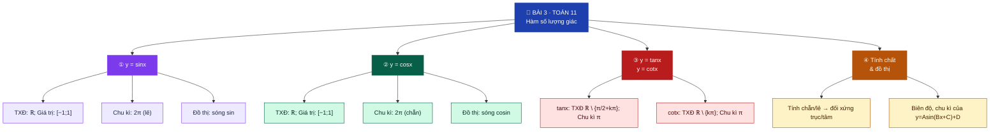

> **Bài củng cố:** <https://trangtu66.github.io/Taode_thi_online/cc_bai3_t11.html>

---

### Toán 11 – Bài 4. Phương trình lượng giác cơ bản *(Tiết 10)*

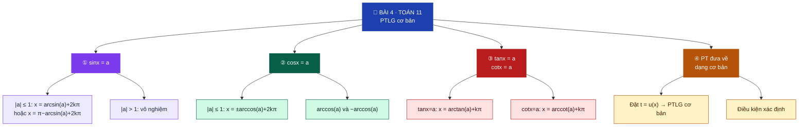

> **Bài củng cố:** <https://trangtu66.github.io/Taode_thi_online/cc_bai4_t11.html>

---

### Toán 11 – Bài 5. Dãy số *(Tiết 11–12)*

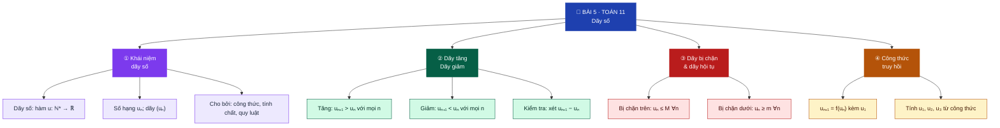

> **Bài củng cố:** <https://trangtu66.github.io/Taode_thi_online/cc_bai5_t11.html>

---

### Toán 11 – Bài 6. Cấp số cộng *(Tiết 13–14)*

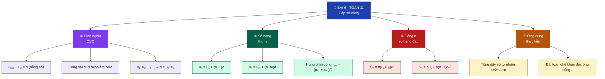

> **Bài củng cố:** <https://trangtu66.github.io/Taode_thi_online/cc_bai6_t11.html>

---

### Toán 11 – Bài 7. Cấp số nhân *(Tiết 15–16)*

```mermaid
graph TD
    G["🎯 BÀI 7 · TOÁN 11<br/>Cấp số nhân"]:::root
    G --> A["① Định nghĩa<br/>CSN"]:::n1
    G --> B["② Số hạng<br/>thứ n"]:::n2
    G --> C["③ Tổng n<br/>số hạng đầu"]:::n3
    G --> D["④ Ứng dụng<br/>thực tiễn"]:::n4

    A --> A1["uₙ₊₁/uₙ = q (hằng số, q≠0)"]:::l1
    A --> A2["Công bội q"]:::l1
    A --> A3["u₁, u₂, u₃... → q = u₂/u₁"]:::l1

    B --> B1["uₙ = u₁ · q^(n−1)"]:::l2
    B --> B2["Trung bình nhân: uₙ² = uₙ₋₁·uₙ₊₁"]:::l2

    C --> C1["q≠1: Sₙ = u₁(1−qⁿ)/(1−q)"]:::l3
    C --> C2["q=1: Sₙ = n·u₁"]:::l3
    C --> C3["|q|<1: S∞ = u₁/(1−q)"]:::l3

    D --> D1["Lãi kép: Aₙ = A₀(1+r)ⁿ"]:::l4
    D --> D2["Tăng trưởng dân số, vi khuẩn"]:::l4
    D --> D3["Bài toán trả góp, tích lũy"]:::l4

    classDef root fill:#1E40AF,color:#fff,stroke:#1E40AF
    classDef n1 fill:#7C3AED,color:#fff,stroke:#7C3AED
    classDef n2 fill:#065F46,color:#fff,stroke:#065F46
    classDef n3 fill:#B91C1C,color:#fff,stroke:#B91C1C
    classDef n4 fill:#B45309,color:#fff,stroke:#B45309
    classDef l1 fill:#EDE9FE,color:#1E293B,stroke:#7C3AED
    classDef l2 fill:#D1FAE5,color:#022c22,stroke:#065F46
    classDef l3 fill:#FEE2E2,color:#450a0a,stroke:#B91C1C
    classDef l4 fill:#FEF3C7,color:#451a03,stroke:#B45309
```

> **Bài củng cố:** <https://trangtu66.github.io/Taode_thi_online/cc_bai7_t11.html>

---

## 📌 Sơ đồ tư duy từng bài – Toán 12

### Toán 12 – Bài 1. Tính đơn điệu và Cực trị *(Tiết 1–6)*

```mermaid
graph TD
    G["🎯 BÀI 1 · TOÁN 12<br/>Tính đơn điệu & Cực trị"]:::root
    G --> A["① Tính đơn điệu<br/>hàm số"]:::n1
    G --> B["② Cực trị<br/>hàm số"]:::n2
    G --> C["③ Quy tắc<br/>tìm cực trị"]:::n3
    G --> D["④ Ứng dụng<br/>thực tiễn"]:::n4

    A --> A1["Đồng biến trên (a;b): y'>0"]:::l1
    A --> A2["Nghịch biến trên (a;b): y'<0"]:::l1
    A --> A3["Lập bảng biến thiên"]:::l1
    A --> A4["Tìm khoảng đơn điệu: giải y'=0"]:::l1

    B --> B1["Cực đại: y' đổi dấu + → −"]:::l2
    B --> B2["Cực tiểu: y' đổi dấu − → +"]:::l2
    B --> B3["y' không đổi dấu: không cực trị"]:::l2

    C --> C1["Quy tắc 1 (dấu y'): BBT"]:::l3
    C --> C2["Quy tắc 2 (y''): y'(x₀)=0, y''(x₀)>0 → Cực tiểu"]:::l3

    D --> D1["Bài toán tối ưu: hộp, bể chứa"]:::l4
    D --> D2["Tìm m để hàm số có/không có cực trị"]:::l4

    classDef root fill:#1E40AF,color:#fff,stroke:#1E40AF
    classDef n1 fill:#7C3AED,color:#fff,stroke:#7C3AED
    classDef n2 fill:#065F46,color:#fff,stroke:#065F46
    classDef n3 fill:#B91C1C,color:#fff,stroke:#B91C1C
    classDef n4 fill:#B45309,color:#fff,stroke:#B45309
    classDef l1 fill:#EDE9FE,color:#1E293B,stroke:#7C3AED
    classDef l2 fill:#D1FAE5,color:#022c22,stroke:#065F46
    classDef l3 fill:#FEE2E2,color:#450a0a,stroke:#B91C1C
    classDef l4 fill:#FEF3C7,color:#451a03,stroke:#B45309
```

> **Bài củng cố:** <https://trangtu66.github.io/Taode_thi_online/cc_bai1_t12.html>

---

### Toán 12 – Bài 2. GTLN – GTNN của hàm số *(Tiết 7–10)*

```mermaid
graph TD
    G["🎯 BÀI 2 · TOÁN 12<br/>GTLN – GTNN hàm số"]:::root
    G --> A["① GTLN, GTNN<br/>trên [a;b]"]:::n1
    G --> B["② GTLN, GTNN<br/>trên ℝ"]:::n2
    G --> C["③ Bài toán<br/>tối ưu hóa"]:::n3
    G --> D["④ Ứng dụng<br/>thực tiễn"]:::n4

    A --> A1["Tìm x₀: y'(x₀)=0 trong (a;b)"]:::l1
    A --> A2["So sánh f(a), f(b) và f(x₀)"]:::l1
    A --> A3["Max = giá trị lớn nhất trong bảng"]:::l1

    B --> B1["Nếu có duy nhất cực đại → GTLN"]:::l2
    B --> B2["Nếu có duy nhất cực tiểu → GTNN"]:::l2
    B --> B3["Hàm bậc 3: không có GTLN/GTNN trên ℝ"]:::l2

    C --> C1["Đặt biến: x là ẩn điều chỉnh được"]:::l3
    C --> C2["Lập hàm mục tiêu f(x)"]:::l3
    C --> C3["Tìm GTLN/GTNN của f trên [a;b]"]:::l3

    D --> D1["Thiết kế hộp, bể chứa tối ưu"]:::l4
    D --> D2["Cấp nước, tưới cà phê Vĩnh Thạnh"]:::l4

    classDef root fill:#1E40AF,color:#fff,stroke:#1E40AF
    classDef n1 fill:#7C3AED,color:#fff,stroke:#7C3AED
    classDef n2 fill:#065F46,color:#fff,stroke:#065F46
    classDef n3 fill:#B91C1C,color:#fff,stroke:#B91C1C
    classDef n4 fill:#B45309,color:#fff,stroke:#B45309
    classDef l1 fill:#EDE9FE,color:#1E293B,stroke:#7C3AED
    classDef l2 fill:#D1FAE5,color:#022c22,stroke:#065F46
    classDef l3 fill:#FEE2E2,color:#450a0a,stroke:#B91C1C
    classDef l4 fill:#FEF3C7,color:#451a03,stroke:#B45309
```

> **Bài củng cố:** <https://trangtu66.github.io/Taode_thi_online/cc_bai2_t12.html>

---

### Toán 12 – Bài 3. Đường tiệm cận *(Tiết 11–13)*

```mermaid
graph TD
    G["🎯 BÀI 3 · TOÁN 12<br/>Đường tiệm cận"]:::root
    G --> A["① Tiệm cận<br/>ngang"]:::n1
    G --> B["② Tiệm cận<br/>đứng"]:::n2
    G --> C["③ Tiệm cận<br/>xiên"]:::n3
    G --> D["④ Số tiệm cận<br/>& bài tập"]:::n4

    A --> A1["lim f(x) = b (x→±∞) → y=b"]:::l1
    A --> A2["Phân thức bậc bằng nhau: y = a/c"]:::l1
    A --> A3["Ví dụ: y=(2x+1)/(x−3) → y=2"]:::l1

    B --> B1["lim f(x) = ±∞ (x→x₀) → x=x₀"]:::l2
    B --> B2["Điểm làm mẫu = 0, tử ≠ 0"]:::l2
    B --> B3["Ví dụ: y=1/(x−2) → x=2"]:::l2

    C --> C1["f(x)/(x) → k ≠ 0 khi x→±∞"]:::l3
    C --> C2["b = lim[f(x)−kx]"]:::l3
    C --> C3["Chia đa thức tìm dạng xiên"]:::l3

    D --> D1["Đếm tiệm cận, vẽ đồ thị đủ TC"]:::l4
    D --> D2["Tìm m để đồ thị có TC đứng/ngang"]:::l4

    classDef root fill:#1E40AF,color:#fff,stroke:#1E40AF
    classDef n1 fill:#7C3AED,color:#fff,stroke:#7C3AED
    classDef n2 fill:#065F46,color:#fff,stroke:#065F46
    classDef n3 fill:#B91C1C,color:#fff,stroke:#B91C1C
    classDef n4 fill:#B45309,color:#fff,stroke:#B45309
    classDef l1 fill:#EDE9FE,color:#1E293B,stroke:#7C3AED
    classDef l2 fill:#D1FAE5,color:#022c22,stroke:#065F46
    classDef l3 fill:#FEE2E2,color:#450a0a,stroke:#B91C1C
    classDef l4 fill:#FEF3C7,color:#451a03,stroke:#B45309
```

> **Bài củng cố:** <https://trangtu66.github.io/Taode_thi_online/cc_bai3_t12.html>

---

### Toán 12 – Bài 4. Khảo sát hàm số *(Tiết 14–18)*

```mermaid
graph TD
    G["🎯 BÀI 4 · TOÁN 12<br/>Khảo sát hàm số"]:::root
    G --> A["① Sơ đồ 5 bước<br/>khảo sát"]:::n1
    G --> B["② Hàm bậc ba<br/>y = ax³+bx²+cx+d"]:::n2
    G --> C["③ Phân thức<br/>y = (ax+b)/(cx+d)"]:::n3
    G --> D["④ Phân thức<br/>y = (ax²+bx+c)/(px+q)"]:::n4

    A --> A1["① TXĐ"]:::l1
    A --> A2["② y': khoảng đơn điệu, cực trị"]:::l1
    A --> A3["③ Giới hạn & tiệm cận"]:::l1
    A --> A4["④ BBT · ⑤ Vẽ đồ thị"]:::l1

    B --> B1["Δ' > 0 → 2 cực trị"]:::l2
    B --> B2["Δ' ≤ 0 → không cực trị"]:::l2
    B --> B3["Tâm đối xứng I(x_I; y_I)"]:::l2

    C --> C1["TC đứng: x = −d/c"]:::l3
    C --> C2["TC ngang: y = a/c"]:::l3
    C --> C3["Không có cực trị"]:::l3

    D --> D1["TC đứng: x = −q/p"]:::l4
    D --> D2["TC xiên: chia đa thức"]:::l4
    D --> D3["Có thể có cực trị"]:::l4

    classDef root fill:#1E40AF,color:#fff,stroke:#1E40AF
    classDef n1 fill:#7C3AED,color:#fff,stroke:#7C3AED
    classDef n2 fill:#065F46,color:#fff,stroke:#065F46
    classDef n3 fill:#B91C1C,color:#fff,stroke:#B91C1C
    classDef n4 fill:#B45309,color:#fff,stroke:#B45309
    classDef l1 fill:#EDE9FE,color:#1E293B,stroke:#7C3AED
    classDef l2 fill:#D1FAE5,color:#022c22,stroke:#065F46
    classDef l3 fill:#FEE2E2,color:#450a0a,stroke:#B91C1C
    classDef l4 fill:#FEF3C7,color:#451a03,stroke:#B45309
```

> **Bài củng cố:** <https://trangtu66.github.io/Taode_thi_online/cc_bai4_t12.html>

---

## 📌 Sơ đồ tư duy từng bài – Vật lí 12

### Vật lí 12 – Bài 1. Cấu trúc của chất. Sự chuyển thể *(Tiết 1–2)*

```mermaid
graph TD
    G["⚡ BÀI 1 · VẬT LÍ 12<br/>Cấu trúc chất & Chuyển thể"]:::root
    G --> A["① Mô hình ĐH<br/>phân tử"]:::n1
    G --> B["② Cấu trúc<br/>3 thể"]:::n2
    G --> C["③ Sự chuyển thể<br/>& sơ đồ"]:::n3
    G --> D["④ Giải thích<br/>bằng MH ĐH"]:::n4

    A --> A1["Chất cấu tạo từ phân tử"]:::l1
    A --> A2["PT chuyển động không ngừng"]:::l1
    A --> A3["Giữa PT: lực hút và đẩy"]:::l1
    A --> A4["Chuyển động Brown (1827)"]:::l1

    B --> B1["Khí: PT cách xa, hỗn loạn"]:::l2
    B --> B2["Rắn: PT sắp xếp trật tự"]:::l2
    B --> B3["Lỏng: trung gian rắn–khí"]:::l2

    C --> C1["Rắn ↔ Lỏng ↔ Khí"]:::l3
    C --> C2["Nóng chảy / Đông đặc"]:::l3
    C --> C3["Hoá hơi / Ngưng tụ"]:::l3
    C --> C4["Thăng hoa / Ngưng kết"]:::l3

    D --> D1["Bay hơi: PT thoát mặt thoáng"]:::l4
    D --> D2["Sôi: nhiệt độ không đổi"]:::l4
    D --> D3["PT nhận NL → phá liên kết"]:::l4

    classDef root fill:#0369A1,color:#fff,stroke:#0369A1
    classDef n1 fill:#7C3AED,color:#fff,stroke:#7C3AED
    classDef n2 fill:#065F46,color:#fff,stroke:#065F46
    classDef n3 fill:#B91C1C,color:#fff,stroke:#B91C1C
    classDef n4 fill:#B45309,color:#fff,stroke:#B45309
    classDef l1 fill:#EDE9FE,color:#1E293B,stroke:#7C3AED
    classDef l2 fill:#D1FAE5,color:#022c22,stroke:#065F46
    classDef l3 fill:#FEE2E2,color:#450a0a,stroke:#B91C1C
    classDef l4 fill:#FEF3C7,color:#451a03,stroke:#B45309
```

> **Bài củng cố:** <https://trangtu66.github.io/Taode_thi_online/ly_cc_bai1_k12.html>

---

### Vật lí 12 – Bài 2. Nội năng. Định luật I NĐLH *(Tiết 3–4)*

```mermaid
graph TD
    G["⚡ BÀI 2 · VẬT LÍ 12<br/>Nội năng – ĐL I Nhiệt động lực học"]:::root
    G --> A["① Nội năng U"]:::n1
    G --> B["② Hai cách<br/>thay đổi U"]:::n2
    G --> C["③ ΔU = A + Q<br/>ĐL I NĐLH"]:::n3
    G --> D["④ Ứng dụng<br/>thực tiễn"]:::n4

    A --> A1["U = ΣĐN + ΣTN phân tử"]:::l1
    A --> A2["U phụ thuộc T và V"]:::l1
    A --> A3["ΔU > 0: nhận NL; ΔU < 0: toả"]:::l1

    B --> B1["Thực hiện công A"]:::l2
    B --> B2["Truyền nhiệt Q"]:::l2
    B --> B3["Ví dụ: bơm khí, đun nóng"]:::l2

    C --> C1["A > 0: hệ nhận công; A < 0: sinh công"]:::l3
    C --> C2["Q > 0: nhận nhiệt; Q < 0: toả nhiệt"]:::l3

    D --> D1["Động cơ nhiệt, bơm tay → nóng"]:::l4
    D --> D2["Máy lạnh: Q thoát ra ngoài"]:::l4

    classDef root fill:#0369A1,color:#fff,stroke:#0369A1
    classDef n1 fill:#7C3AED,color:#fff,stroke:#7C3AED
    classDef n2 fill:#065F46,color:#fff,stroke:#065F46
    classDef n3 fill:#B91C1C,color:#fff,stroke:#B91C1C
    classDef n4 fill:#B45309,color:#fff,stroke:#B45309
    classDef l1 fill:#EDE9FE,color:#1E293B,stroke:#7C3AED
    classDef l2 fill:#D1FAE5,color:#022c22,stroke:#065F46
    classDef l3 fill:#FEE2E2,color:#450a0a,stroke:#B91C1C
    classDef l4 fill:#FEF3C7,color:#451a03,stroke:#B45309
```

> **Bài củng cố:** <https://trangtu66.github.io/Taode_thi_online/ly_cc_bai2_k12.html>

---

### Vật lí 12 – Bài 3. Nhiệt độ. Thang đo nhiệt độ *(Tiết 5–6)*

```mermaid
graph TD
    G["⚡ BÀI 3 · VẬT LÍ 12<br/>Nhiệt độ – Thang đo"]:::root
    G --> A["① Nhiệt độ<br/>là gì"]:::n1
    G --> B["② Thang<br/>Celsius °C"]:::n2
    G --> C["③ Thang<br/>Kelvin K"]:::n3
    G --> D["④ Đo nhiệt độ<br/>thực tiễn"]:::n4

    A --> A1["Đặc trưng mức nóng lạnh"]:::l1
    A --> A2["Tỉ lệ với ĐN trung bình PT"]:::l1
    A --> A3["Cân bằng nhiệt: T₁ = T₂"]:::l1

    B --> B1["0°C: đá tan (p = 1 atm)"]:::l2
    B --> B2["100°C: nước sôi"]:::l2
    B --> B3["Chia 100 khoảng đều"]:::l2

    C --> C1["T(K) = t(°C) + 273"]:::l3
    C --> C2["0 K = −273°C (KTĐ)"]:::l3
    C --> C3["Không có nhiệt độ âm tuyệt đối"]:::l3

    D --> D1["Nhiệt kế hồng ngoại, cảm biến IC"]:::l4
    D --> D2["37°C = 310 K; −40°C = 233 K"]:::l4

    classDef root fill:#0369A1,color:#fff,stroke:#0369A1
    classDef n1 fill:#7C3AED,color:#fff,stroke:#7C3AED
    classDef n2 fill:#065F46,color:#fff,stroke:#065F46
    classDef n3 fill:#B91C1C,color:#fff,stroke:#B91C1C
    classDef n4 fill:#B45309,color:#fff,stroke:#B45309
    classDef l1 fill:#EDE9FE,color:#1E293B,stroke:#7C3AED
    classDef l2 fill:#D1FAE5,color:#022c22,stroke:#065F46
    classDef l3 fill:#FEE2E2,color:#450a0a,stroke:#B91C1C
    classDef l4 fill:#FEF3C7,color:#451a03,stroke:#B45309
```

> **Bài củng cố:** <https://trangtu66.github.io/Taode_thi_online/ly_cc_bai3_k12.html>

---

### Vật lí 12 – Bài 4. Nhiệt dung riêng. Phương trình nhiệt lượng *(Tiết 7–8)*

```mermaid
graph TD
    G["⚡ BÀI 4 · VẬT LÍ 12<br/>Nhiệt dung riêng – PT Nhiệt lượng"]:::root
    G --> A["① Nhiệt dung riêng c<br/>(J/kg·K)"]:::n1
    G --> B["② Phương trình<br/>nhiệt lượng"]:::n2
    G --> C["③ Phương trình<br/>cân bằng nhiệt"]:::n3
    G --> D["④ Ứng dụng<br/>thực tiễn"]:::n4

    A --> A1["c = Q/(mΔT)"]:::l1
    A --> A2["Nước: c = 4 200 J/kg·K (lớn nhất)"]:::l1
    A --> A3["Đồng: 380; Nhôm: 880; Sắt: 460"]:::l1

    B --> B1["Q = mcΔT = mc(t₂ − t₁)"]:::l2
    B --> B2["Δt > 0: thu nhiệt; Δt < 0: toả nhiệt"]:::l2

    C --> C1["Qthu + Qtoả = 0"]:::l3
    C --> C2["ΣmᵢcᵢΔtᵢ = 0"]:::l3

    D --> D1["Bình thuỷ – giữ nước nóng"]:::l4
    D --> D2["Điều hoà không khí, nước làm mát ĐC"]:::l4

    classDef root fill:#0369A1,color:#fff,stroke:#0369A1
    classDef n1 fill:#7C3AED,color:#fff,stroke:#7C3AED
    classDef n2 fill:#065F46,color:#fff,stroke:#065F46
    classDef n3 fill:#B91C1C,color:#fff,stroke:#B91C1C
    classDef n4 fill:#B45309,color:#fff,stroke:#B45309
    classDef l1 fill:#EDE9FE,color:#1E293B,stroke:#7C3AED
    classDef l2 fill:#D1FAE5,color:#022c22,stroke:#065F46
    classDef l3 fill:#FEE2E2,color:#450a0a,stroke:#B91C1C
    classDef l4 fill:#FEF3C7,color:#451a03,stroke:#B45309
```

> **Bài củng cố:** <https://trangtu66.github.io/Taode_thi_online/ly_cc_bai4_k12.html>

---

### Vật lí 12 – Bài 5. Nhiệt nóng chảy riêng *(Tiết 9–10)*

```mermaid
graph TD
    G["⚡ BÀI 5 · VẬT LÍ 12<br/>Nhiệt nóng chảy riêng"]:::root
    G --> A["① Quá trình<br/>nóng chảy"]:::n1
    G --> B["② Nhiệt nóng chảy<br/>riêng λ (J/kg)"]:::n2
    G --> C["③ Quá trình<br/>đông đặc"]:::n3
    G --> D["④ Ứng dụng<br/>thực tiễn"]:::n4

    A --> A1["Chất rắn → lỏng khi nhận nhiệt"]:::l1
    A --> A2["Xảy ra ở nhiệt độ xác định (tnc)"]:::l1
    A --> A3["Trong quá trình nc: t không đổi"]:::l1

    B --> B1["Q = λm"]:::l2
    B --> B2["λ nước đá = 3,4×10⁵ J/kg"]:::l2
    B --> B3["λ nhôm = 3,9×10⁵ J/kg"]:::l2

    C --> C1["Lỏng → rắn khi toả nhiệt Q = λm"]:::l3
    C --> C2["Quá trình ngược nóng chảy"]:::l3
    C --> C3["tđặc = tnc"]:::l3

    D --> D1["Đúc kim loại, hàn điện"]:::l4
    D --> D2["Nước đá làm lạnh thực phẩm"]:::l4
    D --> D3["Luyện kim, tái chế vật liệu"]:::l4

    classDef root fill:#0369A1,color:#fff,stroke:#0369A1
    classDef n1 fill:#7C3AED,color:#fff,stroke:#7C3AED
    classDef n2 fill:#065F46,color:#fff,stroke:#065F46
    classDef n3 fill:#B91C1C,color:#fff,stroke:#B91C1C
    classDef n4 fill:#B45309,color:#fff,stroke:#B45309
    classDef l1 fill:#EDE9FE,color:#1E293B,stroke:#7C3AED
    classDef l2 fill:#D1FAE5,color:#022c22,stroke:#065F46
    classDef l3 fill:#FEE2E2,color:#450a0a,stroke:#B91C1C
    classDef l4 fill:#FEF3C7,color:#451a03,stroke:#B45309
```

> **Bài củng cố:** <https://trangtu66.github.io/Taode_thi_online/ly_cc_bai5_k12.html>

---

### Vật lí 12 – Bài 6. Nhiệt hoá hơi riêng *(Tiết 11–12)*

```mermaid
graph TD
    G["⚡ BÀI 6 · VẬT LÍ 12<br/>Nhiệt hoá hơi riêng"]:::root
    G --> A["① Bay hơi<br/>& Sôi"]:::n1
    G --> B["② Nhiệt hoá hơi<br/>riêng L (J/kg)"]:::n2
    G --> C["③ Ngưng tụ<br/>& Ứng dụng"]:::n3
    G --> D["④ Thực tiễn<br/>địa phương"]:::n4

    A --> A1["Bay hơi: mọi nhiệt độ, ở mặt thoáng"]:::l1
    A --> A2["Sôi: ở tsôi xác định, khắp lòng chất"]:::l1
    A --> A3["tsôi phụ thuộc áp suất"]:::l1

    B --> B1["Q = Lm"]:::l2
    B --> B2["L nước = 2,3×10⁶ J/kg"]:::l2
    B --> B3["L cồn = 9×10⁵ J/kg"]:::l2

    C --> C1["Ngưng tụ: hơi → lỏng, toả Q = Lm"]:::l3
    C --> C2["Điều hoà nhiệt độ cơ thể"]:::l3
    C --> C3["Tua bin hơi nước điện lực"]:::l3

    D --> D1["Mồ hôi làm mát cơ thể người"]:::l4
    D --> D2["Lò hơi, turbine điện Vĩnh Thạnh"]:::l4
    D --> D3["Nước điều hoà khí hậu Tây Nguyên"]:::l4

    classDef root fill:#0369A1,color:#fff,stroke:#0369A1
    classDef n1 fill:#7C3AED,color:#fff,stroke:#7C3AED
    classDef n2 fill:#065F46,color:#fff,stroke:#065F46
    classDef n3 fill:#B91C1C,color:#fff,stroke:#B91C1C
    classDef n4 fill:#B45309,color:#fff,stroke:#B45309
    classDef l1 fill:#EDE9FE,color:#1E293B,stroke:#7C3AED
    classDef l2 fill:#D1FAE5,color:#022c22,stroke:#065F46
    classDef l3 fill:#FEE2E2,color:#450a0a,stroke:#B91C1C
    classDef l4 fill:#FEF3C7,color:#451a03,stroke:#B45309
```

> **Bài củng cố:** <https://trangtu66.github.io/Taode_thi_online/ly_cc_bai6_k12.html>


## 🗺️ Sơ đồ tư duy – Lịch sử 12 Học kì I

```mermaid
graph TD
    A["🌍 LỊCH SỬ 12 – HỌC KÌ I"]:::root
    A --> B["🌐 Chủ đề 1<br/>Thế giới sau CTTG II"]:::chu1
    A --> C["🤝 Chủ đề 2<br/>ASEAN"]:::chu2
    A --> D["🇻🇳 Chủ đề 3<br/>Cách mạng & Kháng chiến"]:::chu3
    A --> E["🔄 Chủ đề 4<br/>Đổi mới & Hội nhập"]:::chu4

    B --> B1["Bài 1. Liên hợp quốc<br/>1945 – 193 thành viên"]:::bai
    B --> B2["Bài 2. Trật tự Chiến tranh lạnh<br/>Hai cực Mỹ–Liên Xô"]:::bai
    B --> B3["Bài 3. Sau Chiến tranh lạnh<br/>Toàn cầu hóa đa cực"]:::bai
    B --> B4["TH1. Thế giới 2 giai đoạn"]:::th

    C --> C1["Bài 4. Ra đời ASEAN 1967<br/>5→10 thành viên"]:::bai
    C --> C2["Bài 5. Cộng đồng ASEAN 2015<br/>3 trụ cột"]:::bai
    C --> C3["TH2. Niên biểu ASEAN"]:::th

    D --> D1["Bài 6. CMTT 1945<br/>2/9/1945 Độc lập"]:::bai
    D --> D2["Bài 7. KC chống Pháp<br/>ĐBP 7/5/1954"]:::bai
    D --> D3["Bài 8. KC chống Mỹ<br/>30/4/1975 Thống nhất"]:::bai
    D --> D4["Bài 9. Bảo vệ TQ sau 1975<br/>Biên giới TN & Bắc"]:::bai
    D --> D5["TH3. So sánh 3 sự kiện"]:::th

    E --> E1["Bài 10. Đổi mới từ 1986<br/>Đại hội VI"]:::bai
    E --> E2["Bài 11. Thành tựu Đổi mới<br/>GDP, hội nhập"]:::bai
    E --> E3["TH4. Hành trình hội nhập"]:::th

    classDef root fill:#1E40AF,color:#fff,stroke:#1E40AF,rx:12
    classDef chu1 fill:#0369A1,color:#fff,stroke:#0369A1,rx:8
    classDef chu2 fill:#0F766E,color:#fff,stroke:#0F766E,rx:8
    classDef chu3 fill:#9A3412,color:#fff,stroke:#9A3412,rx:8
    classDef chu4 fill:#166534,color:#fff,stroke:#166534,rx:8
    classDef bai  fill:#F0F9FF,color:#1E293B,stroke:#7DD3FC,rx:6
    classDef th   fill:#FEF9C3,color:#713F12,stroke:#FDE047,rx:6
```

## 🗺️ Sơ đồ tư duy – Địa lí 12 Học kì I

```mermaid
graph TD
    Z["🌏 ĐỊA LÍ 12 – HỌC KÌ I"]:::root
    Z --> ZA["🌡️ TN – Môi trường<br/>Bài 1–6"]:::nhom
    Z --> ZB["👥 Dân cư – Lao động<br/>Bài 7–10"]:::nhom
    Z --> ZC["🌾 Kinh tế tổng quan<br/>Bài 11"]:::nhom
    Z --> ZD["🌱 Nông–Lâm–Thủy sản<br/>Bài 12–15"]:::nhom
    Z --> ZE["🏭 Công nghiệp<br/>Bài 16–19"]:::nhom

    ZA --> ZA1["Bài 1. Vị trí địa lí<br/>Lãnh thổ 331 212 km²"]:::bai
    ZA --> ZA2["Bài 2. Nhiệt đới ẩm<br/>Gió mùa 4 mùa"]:::bai
    ZA --> ZA3["Bài 3. Phân hoá thiên nhiên<br/>3 miền địa lí"]:::bai
    ZA --> ZA4["TH. Báo cáo phân hoá"]:::th
    ZA --> ZA5["Bài 5. Sử dụng TN & BVMT"]:::bai
    ZA --> ZA6["TH. Tuyên truyền BVMT"]:::th

    ZB --> ZB1["Bài 7. Dân số ~100 triệu<br/>Cơ cấu vàng"]:::bai
    ZB --> ZB2["Bài 8. Lao động & việc làm<br/>52 triệu LĐ"]:::bai
    ZB --> ZB3["Bài 9. Đô thị hoá 40%"]:::bai
    ZB --> ZB4["TH. Phân tích dân cư"]:::th

    ZC --> ZC1["GDP: NN12%–CN36%–DV42%"]:::bai
    ZC --> ZC2["4 vùng KTTĐ"]:::bai

    ZD --> ZD1["Bài 12. Nông nghiệp CNC<br/>Gạo top 3 TG"]:::bai
    ZD --> ZD2["Bài 13. Lâm–Thủy sản<br/>Che phủ 42%, 9.3 triệu tấn"]:::bai
    ZD --> ZD3["Bài 14. Tổ chức lãnh thổ NN<br/>7 vùng"]:::bai
    ZD --> ZD4["TH. Vẽ biểu đồ NN"]:::th

    ZE --> ZE1["Bài 16. Cơ cấu CN<br/>Điện tử top 1 XK"]:::bai
    ZE --> ZE2["Bài 17. Các ngành CN<br/>Dầu khí, điện, dệt may"]:::bai
    ZE --> ZE3["Bài 18. Tổ chức lãnh thổ CN<br/>400 KCN, KKT Nhơn Hội"]:::bai
    ZE --> ZE4["TH. Vẽ biểu đồ CN"]:::th

    classDef root fill:#1E40AF,color:#fff,stroke:#1E40AF,rx:12
    classDef nhom fill:#0F766E,color:#fff,stroke:#0F766E,rx:8
    classDef bai  fill:#F0FDF4,color:#1E293B,stroke:#86EFAC,rx:6
    classDef th   fill:#FEF9C3,color:#713F12,stroke:#FDE047,rx:6
```

