# Hệ thống luyện thi trực tuyến – Trường THPT Vĩnh Thạnh (Gia Lai)

Trang web: <https://trangtu66.github.io/Taode_thi_online/> · Cổng toàn trường: <https://trangtu66.github.io/Taode_thi_online/luyen_thi.html>

Kho gồm hai phần: **trang web** (thư mục gốc) và **kho học liệu theo môn** (`mon/`).

## 1. Kho học liệu theo môn – `mon/<môn>/`

Môn nào cũng có đúng các ngăn như môn Toán:

```
mon/
├── toan/                 Môn Toán (Tổ Toán)
│   ├── khbd/             Kế hoạch bài dạy (Word)      lop10/ lop11/ lop12/
│   ├── slide/            Bài giảng PowerPoint           lop10/ lop11/ lop12/
│   ├── trac_nghiem/      Đề trực tuyến: nguồn JSON + đề Word có đáp án, lời giải   lop10/ lop11/ lop12/
│   └── ma_tran/          Ma trận, bản đặc tả đề luyện tập / kiểm tra
├── ngu_van/              Môn Ngữ văn (bản demo)
├── hoa_hoc/  sinh_hoc/  lich_su/  dia_li/  gdkt_pl/  tieng_anh/   (bản demo: bài củng cố lớp 10)
│   └── mỗi môn: khbd/  slide/  trac_nghiem/  ma_tran/
└── vat_li/               Môn Vật lí (đang xây dựng)
```

Mã môn dùng trong tên thư mục: `toan`, `ngu_van`, `vat_li`, `hoa_hoc`, `sinh_hoc`, `lich_su`, `dia_li`, `gdkt_pl`, `tin_hoc`, `cong_nghe`, `tieng_anh`.

Quy ước tên file: `KHBD_<MÔN><Khối>_<TênBài>_T<Tiết>.docx`, `Slide_<MÔN><Khối>_<TênBài>_T<Tiết>.pptx`
(ví dụ `KHBD_TOAN11_Bai7_T15-16.docx`, `Slide_TOAN11_Bai7_T15-16.pptx`).

## 2. Trang web – thư mục gốc (KHÔNG di chuyển)

Mã QR in trên slide, KHBD và các link đã gửi học sinh trỏ thẳng vào những file này, nên chúng phải nằm yên ở gốc:

| File | Vai trò |
|---|---|
| `index.html` | Trang chủ môn Toán (chuyển link `#e=` sang `lam_bai.html` – giữ nguyên đoạn này) |
| `luyen_thi.html` | Cổng luyện thi toàn trường: chọn môn |
| `luyen_tap.html` | Luyện tập Toán theo bài, chương, định kỳ, tốt nghiệp |
| `lam_bai.html` | Trang làm bài và chấm điểm (dùng chung mọi môn) |
| `quan_ly.html`, `ket_qua.html`, `xep_hang.html` | Quản lí bài, kết quả, xếp hạng |
| `cau_hinh.js` | Danh sách bài + địa chỉ nhận kết quả |
| `de_luyen_tap.js`, `van_demo.js`, `mon_demo.js` | Danh mục đề hiển thị trên cổng |
| `cc_*.html` | Bài củng cố cuối tiết (Toán) – đích của mã QR |
| `lt_*`, `oc_*`, `dk_*`, `tn_*.html` | Đề luyện tập 3 dạng, ôn chương, định kỳ, tốt nghiệp (Toán) |
| `van_*.html` | Bài trực tuyến môn Ngữ văn |
| `hoa_*`, `sinh_*`, `su_*`, `dia_*`, `gdkt_*`, `anh_*.html` | Bài trực tuyến Hóa, Sinh, Sử, Địa, GDKT&PL, Tiếng Anh |
| `*.png`, `hinh_de/` | Ảnh minh hoạ trong đề (các trang làm bài đang dùng) |

Trang làm bài của môn mới đặt tên theo mẫu `<mã môn>_<loại>_<bài>_k<khối>.html`, ví dụ `ly_cc_bai1_k10.html`.

## 3. Không đưa lên kho

`NHAN_KET_QUA/` (mã giáo viên, mã Apps Script) và đề kiểm tra chính thức trước giờ thi.

---

## 4. Sơ đồ tư duy bài học

### Toán 12 – Bài 4. Khảo sát sự biến thiên và vẽ đồ thị hàm số *(Tiết 14–18)*

```mermaid
graph TD
    Goc["🎯 BÀI 4 · TOÁN 12\nKhảo sát sự biến thiên\nvà vẽ đồ thị hàm số"]

    Goc --> B1(("① Sơ đồ\nkhảo sát"))
    Goc --> B2(("② Hàm\nbậc ba"))
    Goc --> B3(("③ Phân thức\nax+b / cx+d"))
    Goc --> B4(("④ Phân thức\nax²+bx+c / px+q"))

    B1 --> B1a["📌 Bước 1: Tập xác định"]
    B1 --> B1b["📌 Bước 2: Khảo sát biến thiên\ny', cực trị, giới hạn, BBT"]
    B1 --> B1c["📌 Bước 3: Vẽ đồ thị\n(giao trục, tiệm cận, điểm đặc biệt)"]

    B2 --> B2a["y = ax³+bx²+cx+d\n(a ≠ 0)"]
    B2 --> B2b["Δ' > 0 → có cực trị\nΔ' ≤ 0 → không cực trị"]
    B2 --> B2c["Tâm đối xứng:\nx_I = –b / 3a"]
    B2 --> B2d["Không có tiệm cận"]

    B3 --> B3a["y = (ax+b) / (cx+d)\n(ad–bc ≠ 0)"]
    B3 --> B3b["TC đứng: x = –d/c"]
    B3 --> B3c["TC ngang: y = a/c"]
    B3 --> B3d["Tâm ĐX = giao hai tiệm cận\nKhông có cực trị"]

    B4 --> B4a["y = (ax²+bx+c) / (px+q)\n(a ≠ 0)"]
    B4 --> B4b["TC đứng: x = –q/p"]
    B4 --> B4c["TC xiên: y = (a/p)x + k\n(chia đa thức tử/mẫu)"]
    B4 --> B4d["Có thể có cực trị\n(xét dấu y')"]

    style Goc fill:#0056b3,stroke:#003580,stroke-width:3px,color:#fff,font-weight:bold
    style B1 fill:#6f42c1,stroke:#4a2d8c,stroke-width:2px,color:#fff
    style B2 fill:#1a6b3c,stroke:#114a2a,stroke-width:2px,color:#fff
    style B3 fill:#c0392b,stroke:#922b21,stroke-width:2px,color:#fff
    style B4 fill:#c47a00,stroke:#8a5500,stroke-width:2px,color:#fff
    style B1a fill:#ede7f6,stroke:#6f42c1,color:#1a0050
    style B1b fill:#ede7f6,stroke:#6f42c1,color:#1a0050
    style B1c fill:#ede7f6,stroke:#6f42c1,color:#1a0050
    style B2a fill:#e8f5e9,stroke:#1a6b3c,color:#0a2e18
    style B2b fill:#e8f5e9,stroke:#1a6b3c,color:#0a2e18
    style B2c fill:#e8f5e9,stroke:#1a6b3c,color:#0a2e18
    style B2d fill:#e8f5e9,stroke:#1a6b3c,color:#0a2e18
    style B3a fill:#fdecea,stroke:#c0392b,color:#5a0000
    style B3b fill:#fdecea,stroke:#c0392b,color:#5a0000
    style B3c fill:#fdecea,stroke:#c0392b,color:#5a0000
    style B3d fill:#fdecea,stroke:#c0392b,color:#5a0000
    style B4a fill:#fff8e1,stroke:#c47a00,color:#4a2d00
    style B4b fill:#fff8e1,stroke:#c47a00,color:#4a2d00
    style B4c fill:#fff8e1,stroke:#c47a00,color:#4a2d00
    style B4d fill:#fff8e1,stroke:#c47a00,color:#4a2d00
```



> **Bài củng cố trực tuyến:** <https://trangtu66.github.io/Taode_thi_online/cc_bai4_t12.html>
